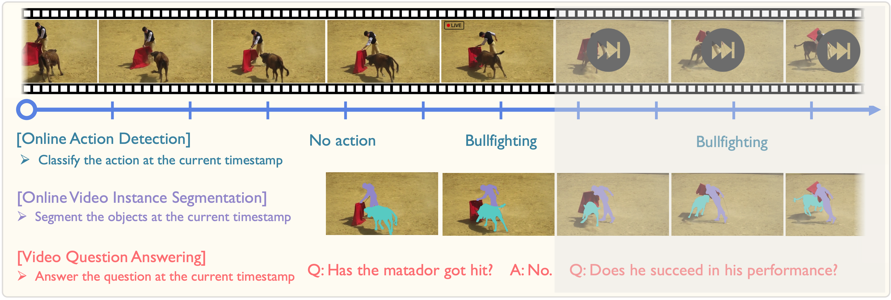

# StreamFormer
[ICCV 2025] The official PyTorch implementation of Learning Streaming Video Representation via Multitask Training: https://arxiv.org/abs/2504.20041

  
  

   

## TODO
- [ ] Add instructions for quick start.
- [ ] Add downstream evaluation pipelines.
- [ ] Release StreamFormer Checkpoints.

