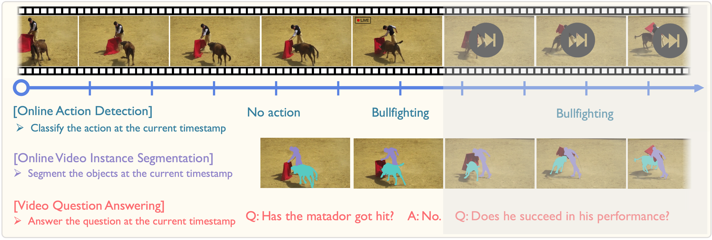
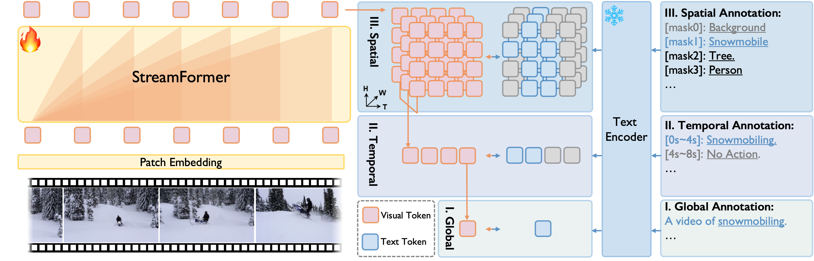

# Learning Streaming Video Representation via Multitask Training
Official implementation of **Learning Streaming Video Representation via Multitask Training**, ICCV 2025 (Oral)

[*Yibin Yan**](https://go2heart.github.io/), 
[*Jilan Xu**](https://jazzcharles.github.io/), 
[*Shangzhe Di*](https://dszdsz.cn/), 
[*Yikun Liu*](https://code-kunkun.github.io/), 
[*Yudi Shi*](https://github.com/zhengrongz), 
[*Qirui Chen*](https://qirui-chen.github.io/), 
[*Zeqian Li*](https://lzq5.github.io/), 
[*Yifei Huang*](https://hyf015.github.io/), 
[*Weidi Xie*](https://weidixie.github.io/)

(*: equal contribution)

<div style="line-height: 1;">
  <a href="https://go2heart.github.io/streamformer/" target="_blank" style="margin: 2px;">
    
  </a>
  <a href="https://arxiv.org/abs/2504.20041" target="_blank" style="margin: 2px;">
    
  </a>
  <a href="https://huggingface.co/StreamFormer/streamformer-timesformer" target="_blank" style="margin: 2px;">
    
  </a>
</div>

<div align="center">
   
   
</div>

## TODO
- [x] Add instructions for quick start.
- [x] Add downstream evaluation pipelines.
- [x] Release StreamFormer Checkpoints.
- [x] Release Datasets Annotations.

## Quick Start
### Installation
```bash
git clone https://github.com/Go2Heart/StreamFormer.git
cd StreamFormer
conda create -n streamformer python=3.10
conda activate streamformer
conda install pytorch==2.5.1 torchvision==0.20.1 torchaudio==2.5.1 pytorch-cuda=12.4 -c pytorch -c nvidia
pip install -r requirements.txt
```

### Pre-trained Model Usage
We have uploaded our streamformer pre-trained on *Global*-, *Temporal*- and *Spatial*- granularities to [🤗huggingface](https://huggingface.co/StreamFormer/streamformer-timesformer).

#### Inference Usage

```python
from models import TimesformerMultiTaskingModelSigLIP
import torch
model = TimesformerMultiTaskingModelSigLIP.from_pretrained("StreamFormer/streamformer-timesformer").eval()
with torch.no_grad():
    fake_frames = torch.randn(1, 16, 3, 224, 224)
    fake_frames = fake_frames.to(model.device)
    output = model(fake_frames)
    # global representation [B, D]
    print(output.pooler_output[:,-1].shape, output.pooler_output[:,-1])
    
    # temporal representation [B, T, D]
    print(output.pooler_output.shape, output.pooler_output)
    
    # spatial representation [B, T, HxW, D]
    print(output.last_hidden_state.shape, output.last_hidden_state)
```

### Pre-training 
To download our pre-training video annotations, use this [link](https://www.dropbox.com/scl/fi/f5utos9fb7irfekpcw1ir/streamformer_annotation.zip?rlkey=t8utee0lmhlxxtv8payti6j1q&st=lbhe29kk&dl=0).

Change some necessary paths in [scripts/pretrain_streamformer.sh](scripts/pretrain_streamformer.sh) and [dataset metadata](scripts/dataset_metadata/all.yaml), and run the scripts.
```bash
bash scripts/pretrain_streamformer.sh 
```


### Evaluations
#### 1. Action Recognition

Check the [README](downstream/AR/README.md) of Action Recognition.

#### 2. Online Action Detection

Check the [README](downstream/OAD/README.md) of Online Action Detection.

#### 3. OVIS

Follow the [README](downstream/OVIS/README.md) of CTVIS to install the corresponding environment.

Train StreamFormer for OVIS.
```bash
export DETECTRON2_DATASETS=/PATH/TO/VIS/DATA;
python -m downstream.OVIS.train_ctvis --resume --config-file downstream/OVIS/configs/ytvis_2019/CTVIS_Streamformer.yaml --num-gpus 4
```

#### 4. VideoQA
[🔥News!] We have released our new VideoQA Model (VideoMME(w/o subtitles): 55.0) based on Qwen2.5: [[🤗HF Link]](https://huggingface.co/StreamFormer/streamformer-llava-Qwen2.5-7B-Instruct/tree/main).

The model can now inference for streaming video input (e.g. when the input video and user query is asynchronous) , with KV-Cache enabled for StreamFormer! For usage example, please check out our naive test script [test_kvcache.py](downstream/VideoQA/test_kvcache.py).


Follow the [README](downstream/VideoQA/README.md) of LLaVA-NeXT to install the corresponding environment.

Prepare the necessary data:
 - [LLaVA-Pretrain](https://huggingface.co/datasets/liuhaotian/LLaVA-Pretrain)
 - [LLaVA-Next-Data](https://huggingface.co/datasets/lmms-lab/LLaVA-NeXT-Data)
 - [LLaVA-Video-178K](https://huggingface.co/datasets/lmms-lab/LLaVA-Video-178K)

Train StreamFormer checkpoint in 3 statges.
```bash
cd downstream/VideoQA
## stage 1 for pretraining
bash scripts/train/stage1_pretrain_timesformer_siglip_base.sh

## stage 2 for image-qa instruction tuning
bash scripts/train/stage2_direct_finetune_timesformer_siglip_base.sh 

## stage 3 for video-qa instruction tuning
bash scripts/train/stage3_direct_finetune_timesformer_video_only.sh 
```

For Video QA evaluation, you can use this initial [model checkpoint](https://huggingface.co/StreamFormer/streamformer-llava-vicuna-7b-v1.5/tree/main) for now to run the evaluation code in our [example](downstream/VideoQA/eval_video.sh)(swapping the ckpt path).

## Ackowledgements
Thanks to the codebase of [UMT](https://github.com/OpenGVLab/unmasked_teacher/tree/main), [transformers](https://github.com/huggingface/transformers/tree/main), [MAT](https://github.com/Echo0125/MAT-Memory-and-Anticipation-Transformer), [CTVIS](https://github.com/KainingYing/CTVIS), [LLaVA-Next](https://github.com/LLaVA-VL/LLaVA-NeXT/tree/main?tab=readme-ov-file).

## Citations
If you find our work useful, please cite:
```bibtex
@misc{yan2025learning,
    title={Learning Streaming Video Representation via Multitask Training},
    author={Yibin Yan and Jilan Xu and Shangzhe Di and Yikun Liu and Yudi Shi and Qirui Chen and Zeqian Li and Yifei Huang and Weidi Xie},
    year={2025},
    eprint={2504.20041},
    archivePrefix={arXiv},
    primaryClass={cs.CV}
}
```
