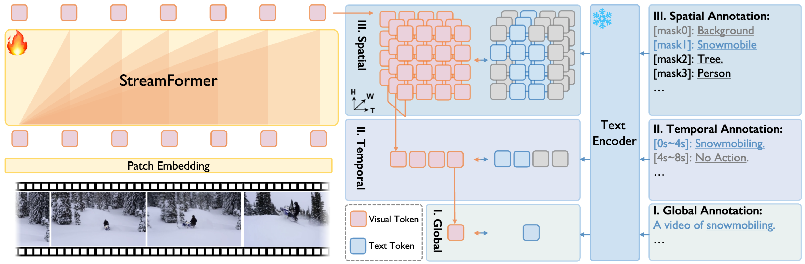

# Learning Streaming Video Representation via Multitask Training
[ICCV 2025] The official PyTorch implementation of Learning Streaming Video Representation via Multitask Training: https://arxiv.org/abs/2504.20041

<div style="line-height: 1;">
  <a href="https://go2heart.github.io/streamformer/" target="_blank" style="margin: 2px;">
    
  </a>
  <a href="https://arxiv.org/abs/2504.20041" target="_blank" style="margin: 2px;">
    
  </a>
</div>

<div align="center">
   
   
</div>

## TODO
- [x] Add instructions for quick start.
- [x] Add downstream evaluation pipelines.
- [ ] Release StreamFormer Checkpoints.

## Quick Start
### Installation
```bash
conda create -n streamformer python=3.10
conda activate streamformer
conda install pytorch==2.5.1 torchvision==0.20.1 torchaudio==2.5.1 pytorch-cuda=12.4 -c pytorch -c nvidia
pip install -r requirements.txt
```

### Pre-training 
Change some necessary paths in [scripts/pretrain_streamformer.sh](scripts/pretrain_streamformer.sh) and [dataset metadata](scripts/dataset_metadata/all.yaml), and run the scripts.
```bash
bash scripts/pretrain_streamformer.sh 
```


### Evaluations
1. OAD

2. OVIS

3. VideoQA


## Citations

## Ackowledgements
Thanks to the codebase of [UMT](https://github.com/OpenGVLab/unmasked_teacher/tree/main), [transformers](https://github.com/huggingface/transformers/tree/main), [MAT](https://github.com/Echo0125/MAT-Memory-and-Anticipation-Transformer), [CTVIS](https://github.com/KainingYing/CTVIS), [LLaVA-Next](https://github.com/LLaVA-VL/LLaVA-NeXT/tree/main?tab=readme-ov-file).